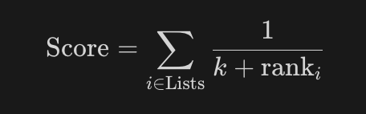

## 一、搜索技术流程

### 1.搜索方式的双管齐下 

从左侧的“知识库”出发，系统通常会同时运行两种搜索方式：

- **关键词搜索 (Keyword Search)：**原理：传统的词频统计匹配（如 BM25 算法）。它寻找文档中是否出现了与查询完全一致的单词。**优势：** 擅长查找特定的人名、产品型号或专业术语。
- **语义搜索 (Semantic Search)：**原理：基于向量（Embedding）的相似度匹配。它寻找意思相近的内容，即使单词并不完全一样。**优势：** 擅长处理模糊提问和理解上下文意图（例如搜索“开心”能找回包含“愉快”的文档）。

### 2. 初步筛选

- 中间的深蓝色方框提到：**“每次搜索返回 20 - 50 个文档”**。
- **逻辑：** 这一步是“大范围撒网”。系统先从海量数据中分别通过两种手段捞出几十篇潜在相关的候选文档。注意图中，文档 B 和 C 可能会同时出现在两条路径的初选名单中。

### 3. 元数据过滤

这是流程中红色的“漏斗”图标所代表的关键步骤：

- **什么是元数据过滤？**
  除了文字内容外，利用文档的标签（如日期、分类、作者、语言、权限等）进行硬性剔除。
- **课件中的表现：**上路：文档 C 和 D 因为不符合元数据条件（例如：日期太久或分类不对）被划掉了（灰色/删除线）。**下路：** 文档 C 同样被过滤掉了。
- **作用：** 确保检索到的信息不仅“意思相关”，而且“属性合规”（例如只看 2024 年的新闻）。

### 4. 最终结果汇总

- **整合：** 经过过滤后，系统将两条路径剩下的优质文档（如文档 A、B、X、Y）汇总在一起。
- **输出：** 这些最终选出的文档将被送入 LLM（大模型）的提示词中，作为回答问题的依据。

## 二、元数据过滤的优点与局限

### 优点—— 为什么我们要用它？

1. **易于理解与调试：**逻辑非常直观。如果一个文档被排除了，你可以轻易发现原因（例如：“它的日期是 2023 年，而我设置了只看 2024 年”）。这比调试复杂的向量语义搜索要简单得多。
2. **快速、优化、成熟且可靠：**这种技术基于传统的数据库索引，速度极快且极其稳定。在处理数百万条数据时，过滤掉不符合条件的标签几乎是瞬间完成的。
3. **强制执行严格的检索规则：**它能确保**绝对匹配**。如果你要求“只要 PDF”，它绝不会给你发一个 Word 文档。它能有效处理那些语义搜索难以处理的“硬约束”。

### 缺点—— 它的局限在哪里？

1. **非真正意义上的搜索：**它本身并不能“寻找答案”。它只是在缩小范围。如果你只用元数据过滤，你得到的只是一堆符合标签的文档，而不是用户问题的答案。
2. **僵化、忽略内容且无法排序 ：**忽略内容：它完全不看文档里写了什么。一个标题里包含答案的文档，可能仅仅因为没有正确的标签就被过滤掉。**无法排序：** 它的结果是二进制的（要么符合，要么不符合）。你无法判断两篇 2024 年的文档哪一篇更相关，因为它没有“相似度分数”。
3. **无法单独使用 ：**这是最关键的一点。在 RAG 系统中，元数据过滤通常扮演**辅助角色**。你必须把它和**关键词搜索**或**语义搜索**结合起来——先用过滤缩小范围，再用搜索在剩下的文档里找答案。

## 三、核心概念

### 1.词袋模型

- **核心定义：** “忽略词序，只关注单词的出现及其频率。”
- **形象比喻：** 想象你有一个布袋，把句子里的所有单词都扔进去。当你摇晃这个袋子时，单词的先后顺序（语法、逻辑）都打乱了，但袋子里单词的种类和数量是不变的。
- **示例分析：**提示词："Making pizza without a pizza oven"（不用披萨烤箱做披萨）**提取关键词：**pizza: 出现了 2 次。**without:** 出现了 1 次。**making:** 出现了 1 次。**oven:** 出现了 1 次。**a:** 出现了 1 次。
- **局限性：** 因为忽略了顺序，词袋模型无法区分“狗咬人”和“人咬狗”，因为它只看这两个词是不是都出现了。

### 2.词表

在构建一个搜索系统（如 RAG 的检索部分）时，计算机首先会扫描你**整个知识库**（几万篇文档或全网数据），把里面出现过的所有**不同的单词**提取出来，排成一个极其漫长的清单。这个清单就叫**词表（Vocabulary）**。在这个例子中，计算机的词表里包含了成千上万个单词，其中就包括了 cake（蛋糕）、pan（平底锅）、burger（汉堡）等。为了让计算机对比两个句子是否相似，它必须用**同样的标准**来衡量所有的文本。

### 3.稀疏向量

- **什么是向量？** 在计算机里，一段文本被表示为一串长长的数字。
- **稀疏性的含义：**人类语言的词汇量非常庞大（比如有 10 万个词）。在表示 "Making pizza without a pizza oven" 这个句子时，计算机必须为**词典里所有的词**都准备一个位置。**红色方块 (1)：** 代表句子中出现的词（如 making, pizza, without...）。**灰色方块 (0)：** 代表句子中**没出现**的词（如 cake, pan, drink, burger...）。
- **为什么叫“稀疏”？** 正如底部文字所说：“大多数词都没有被用到。”在一个 10 万维度的向量里，只有 5-6 个位置是 1，其余 99,990 多个位置全是 0。这种 **“0 多 1 少”** 的数据结构就叫 **稀疏向量**。

### 4.关键词检索（如 BM25 算法）的工作方式：

1. **索引阶段：** 知识库里的每一篇文档都会被转换成这样一个巨大的“稀疏向量”。
2. **查询阶段：** 你的提问（Prompt）也会被转换成一个稀疏向量。
3. **匹配阶段：** 计算机快速对比两个稀疏向量，看它们在哪些位置同时出现了“1”。**重合的“1”越多（即共同的关键词越多），文档的相关性排名就越高。**

## 四、简单评分与词频评分

1. 简单评分：只要文档中**出现**了查询里的关键词，就给分。它不关心这个词出现了几次。
2. 词频（Term Frequency）评分：单词出现的**次数越多，分数越高**。

## 五、归一化词频评分

### 1. 核心问题：长文档的偏差

- **课件指出：** 长文档包含关键词的次数更多，可能仅仅是因为它**更长**。
- **直观理解：**假设你有一篇 10 个词的短简讯，提到了 2 次“披萨”。你还有一本 1000 个词的百科全书，提到了 5 次“披萨”。**如果不进行归一化：** 百科全书得分更高（5 > 2），系统会认为百科全书更相关。**现实情况：** 那篇短简讯 20% 的内容都在聊披萨，而百科全书只有 0.5% 的内容提到披萨。显然，短简讯对用户来说可能更精准、更相关。

### 2. 解决方案：按文档长度归一化

为了公平起见，我们不能只看“绝对次数”，而要看“**关键词密度**”。

- **计算公式：**

  ```latex
  评分 (Score)=关键词出现的次数 (Number of keyword occurrences)/文档中的总词数 (Total words in document)
  ```

### 3. 为什么这在 RAG 系统中很重要？

1. **防止“长度溢出”：** 在 RAG 中，我们会将长文档切成很多块（Chunks）。如果检索器只倾向于找最长的块（因为包含关键词多），那么很快就会填满 LLM 的上下文窗口，导致效率低下。
2. **提高检索精度：** 归一化帮助检索器找到那些**核心主题**与用户查询最匹配的文本片段。
3. **BM25 算法的基础：** 工业界最常用的关键词检索算法 **BM25**，其核心逻辑之一就是对文档长度进行惩罚（惩罚过长的文档），这正是基于这页课件所讲的归一化思想。

## 六、TF-IDF


这页课件解释了信息检索领域最经典、最核心的算法之一：**TF-IDF**。它是对前面提到的“词频评分”的进一步进化。它的核心思想是：**不仅要看一个词在文档里出现的次数，还要看这个词到底有多“稀有”。**

### 1. 核心问题：单词并不平等

- **课件指出：** 基础的词频评分对所有单词一视同仁。
- **直观理解：**常用的“废话词”，比如 "the"、"is"、"a"、"的"、"了"。稀有的“关键性词”，比如 "量子力学"、"披萨烤箱"、"破产申请"。**如果不加区别：** 如果你搜索“the pizza”，由于 "the" 在每篇文档里都会出现几十次，而 "pizza" 可能只出现几次，系统会倾向于找回那些包含大量 "the" 的无意义文档。这显然不是用户想要的。

### 2. 解决方案：逆文档频率 (IDF - Inverse Document Frequency)

为了解决这个问题，我们需要给单词“加权”：**越常见的词，权重越低；越罕见的词，权重越高。**

### 3. 公式拆解

课件给出了经典的计算公式：

```latex
评分 (Score)=TF(word,doc)×log(文档总数/包含该词的文档数)
```

这个公式由两部分相乘组成：

1. 左半部分TF(word,doc)：
   - 表示这个词在当前这篇文档里出现了多少次。
   - **逻辑：** 出现次数越多，说明这篇文档越可能在聊这个话题。
2. 右半部分log⁡(…)（这就是 IDF）：
   - **分母（包含该词的文档数）：** 如果一个词在图书馆里几乎每一本书里都有（比如 "the"），分母就很大，整个分数就接近 1，`log⁡(1)=0`。这意味着这个词的权重几乎被抵消为 0。
   - **分子（文档总数）：** 如果一个词只在极少数文档中出现（比如 "披萨"），分母就很小，整个分数就很大，`log⁡(很大)` 依然是一个可观的正数。
   - **逻辑：** 这个词越“罕见”，它的信息量就越大，权重就越高。

### 4. 总结：TF-IDF 的终极含义

**TF-IDF 衡量的是一个词对某篇文档的重要性。**

- **高分词：** 如果一个词在**这篇文档里出现很多次**，但在**其他文档里很少见**，那么它就是这篇文档的“关键词”（比如这篇文档专门讲“披萨烤箱”）。
- **低分词：** 如果一个词在所有文档里都经常出现（比如 "是"），无论它在当前文档里出现多少次，它的得分都会很低。

### 5. 在 RAG 系统中的意义

在 RAG 的检索阶段，TF-IDF（及其进化版 BM25 算法）是 **关键词搜索（稀疏向量搜索）** 的灵魂。它能帮助检索器：

1. **自动忽略废话词**的干扰。
2. **锁定真正关键的信息**（比如型号、专业名词）。
3. **精准匹配**：确保大模型拿到的是真正包含用户关心的“核心知识”的文档。

## 七、BM25 评分算法

如果你把之前的 TF-IDF 看作是搜索算法的“初级版”，那么 **BM25 （Best Matching 25）**就是它的“工业级增强版”。它是目前全球绝大多数搜索引擎（如 Elasticsearch, Solr, Lucene）默认使用的核心算法，也是 RAG 系统中“关键词检索”分支的灵魂。


#### **第一部分：`IDF`（逆文档频率/稀有分）**

- 和你刚才问的内容一模一样：**越稀有的词，权重越高**。

#### **第二部分：`TF` 饱和度（Saturation）限制（分子与分母中的 `TF` 和 `k1`）**

- **TF-IDF 的缺点：** 在老算法里，如果“披萨”出现 100 次，分数就是出现 1 次的 100 倍。这不合理，因为读 10 遍和读 100 遍，对主题的理解差别不大了。
- **BM25 的改进：** 它引入了常数 `k1`。随着词频（`TF`）的增加，分数的增长会越来越慢，最终达到一个**“饱和点”**。
- **通俗比喻：** 你吃 1 个披萨很饱，吃 2 个更饱，但吃第 10 个时，带给你的满足感几乎不再增加了。

#### **第三部分：文档长度归一化（分母里的 `b` 和长度比值）**

- **原理：** 公式里对比了当前文档长度和平均文档长度。
- **逻辑：**如果一篇**短文章**提到了 3 次“披萨”，说明它极度相关。如果一本**厚书**提到了 3 次“披萨”，说明它只是顺便提了一下。
- **改进：** 常数 `b` 用来惩罚那些通过“长篇大论”来骗取高分的文档，让检索对短小精悍的文档更公平。

## 八、BM25 算法核心优势

### 1. 词频饱和度

这一部分解释了：**单词出现的次数越多，真的代表文档越重要吗？**

- **TF-IDF 的做法（左侧）：线性增长。**如果“pizza”出现 10 次得 X 分，那么出现 20 次就得 **2X 分**。**缺点：** 这种逻辑很死板。在一篇文章里提 10 次“披萨”和提 100 次“披萨”，它们在“关于披萨”这个主题上的关联度其实差别不大了。
- **BM25 的改进（右侧）：边际效益递减（饱和）。**如果“pizza”出现 10 次得 X 分，那么出现 20 次只得 **1.3X 分**。**原理：** BM25 认为单词出现的次数对分数的贡献是会“饱和”的。多出来的 10 次提到，带来的额外信息量是有限的。**通俗比喻：** 你看一个披萨广告 1 遍印象深刻，看 2 遍更深，但看第 100 遍时，你并不会比看第 50 遍时更想买披萨。

### 2. 文档长度归一化

这一部分解释了：**如何公平地对待长文章和短文章？**

- **TF-IDF 的做法（左侧）：惩罚太重。**TF-IDF 在进行长度修正时非常极端。它会给长文档施加“沉重的惩罚”。**结果：** 导致系统过度偏向短文档，哪怕长文档里包含了更有价值的细节，也可能因为篇幅长而被埋没。
- **BM25 的改进（右侧）：更合理的平衡。**BM25 对长文档的惩罚更小。**原理：** 它通过公式中的常数（如 `b` 参数）来调节。它承认长文章天然就会包含更多的单词，所以它不会因为文章长就直接判定它不相关，而是给长短文档一个更公平的竞争平台。**通俗比喻：**TF-IDF 像是一个严苛的考官：因为你的作文写得长，所以我要求你的关键词密度必须极高，否则就判你低分。**BM25** 则是一个理智的考官：你写得长，我允许你的关键词密度稍微低一点，只要核心内容对得上，我依然给你高分。

### 3.可调参数：`k1` 和 `b`

### `k1` 参数：控制“词频饱和度” 

- **它的作用：** 决定了“单词出现的次数”对总分的影响有多大。
- **数值范围：** 通常在 **1.2 到 2.0** 之间。
- **具体效果：**高 `k1`值（接近 2.0）：给予词频更高的权重。如果你在文章里多提了几次关键词，分数会持续增长。这适用于那些关键词出现次数确实代表重要性的场景。**低** `k1` **值（接近 1.2）：** 分数会更快地达到“饱和”。也就是说，提到 3 次和提到 20 次的分数差别不会太大。
- **通俗比喻：** `k1` 决定了模型对“重要的事情说三遍”这句话的认可程度。如果你觉得说 20 遍比说 3 遍重要得多，就调高 `k1`；如果你觉得说 3 遍就够了，再多说就是废话，就调低 `k1`。

### `b` 参数：控制“长度归一化”

- **它的作用：** 决定了系统如何“惩罚”长文档。
- **数值范围：** **0 到 1** 之间。
- **具体效果：b=0（无归一化）：** 完全不考虑文档长度。长文档因为天生单词多，更容易包含关键词，所以在 `b=0` 时，长文档会有巨大的不公平优势。b=1**（完全归一化）：** 严格根据长度惩罚。如果一本书和一张传单提到关键词次数一样，传单（短文档）会获得极高的分数，因为它的关键词“密度”大。
- **通俗比喻：** `b` 是一个“公平天平”。
  - 如果调到 **1**，你就是在说：“我喜欢短小精悍、直击重点的内容。”
  - 如果调到 **0**，你就是在说：“只要里面提到了关键词，管它文章有多长呢。”
  - **经验值：** 在工业界，人们通常把 `b` 设为 **0.75**，这是一个平衡长短文档的黄金分割点。

### 4. 更好的性能

- **含义：** 相比于 TF-IDF，BM25 检索出来的文档相关性更高。
- **原因：** 正如之前课件提到的，BM25 解决了 TF-IDF 的两个核心痛点：**词频饱和度：** 防止某个单词出现次数过多而导致分值无限膨胀。**长度归一化：** 它对长短文档的平衡处理更符合人类对“相关性”的直觉。

### 5. 相同的成本

- **含义：** 这里的“成本”指的是计算资源（CPU、内存）和检索速度。
- **原因：**虽然 BM25 的公式看起来比 TF-IDF 复杂，但在计算机底层，它们都属于**“稀疏向量检索”**。它们都依赖于同一种数据结构——**倒排索引**。在处理数百万条数据时，计算 BM25 分数所多花的那一点点 CPU 时间几乎可以忽略不计。

### 6. 更高的灵活性

- **含义：** BM25 是可以“调优”的。
- **原因：**TF-IDF 基本上是一个死公式。BM25 拥有 `k1` 和 `b` 两个可调参数。这意味着开发者可以根据自己的数据类型（是短推文、技术文档还是医疗记录）来手动调整天平，从而获得最佳效果。

## 总结

### 1. 核心逻辑：基于词频的匹配 

关键词搜索的本质是：**大模型需要寻找包含特定词汇的文档**。系统通过计算这些词汇在文档中出现的“频率”来衡量文档的相关性。

### 2. 工作流程

这是计算机处理搜索请求的三个标准化步骤：

1. **稀疏向量：** 将文档和用户的提问转化为数字。就像我们之前看到的，除了出现的关键词有分值外，其余几万个格子的词都是 0。
2. **计分：** 使用数学公式（如 TF-IDF 或 BM25）给每个文档打分。
3. **排序：** 根据分值高低进行排列。分数最高的文档会被最先提取出来，交给 LLM 作为回答问题的参考。

### 3. 两大算法对比

课件对比了关键词搜索中最重要的两个算法：

#### **TF-IDF（经典基础）**

它考虑了三个维度：

- **关键词稀有度 ( IDF)：** 越罕见的词（如“超导”）权重越高，越常见的词（如“的”）权重越低。
- **词频：** 关键词在文档中出现的次数越多越好。
- **文档长度：** 对长文档进行修正，防止它们仅仅因为篇幅长而获得高分。

#### **BM25**

它是对 TF-IDF 的优化，也是目前最常用的算法。它在 TF-IDF 的基础上着重解决了两个问题：

- **文档长度归一化：** 能够更公平、更科学地平衡长短文档的权重。
- **词频饱和度：** 限制了单词出现次数的边际收益。即：提到 50 次并不比提到 10 次相关 5 倍。


## 九、语义搜索与关键词搜索

### 1. 共同点：数字化

- **Prompt and documents each get a vector（提示词和文档各获得一个向量）：**
  无论是哪种搜索，计算机都无法直接“读懂”文字。第一步都是将用户的提问和数据库里的文档转化成一串数字列表，这串数字就叫向量。
- **Vectors compared to generate scores（对比向量以生成评分）：**
  一旦变成了数字，计算机就可以通过数学公式（如余弦相似度）计算两个向量之间的“距离”。距离越近，分值越高，代表两者越相关。

### 2. 核心区别：向量是如何生成的？

#### **关键词搜索：统计单词数量**

- **原理：** 这种方式生成的叫**稀疏向量**。
- **逻辑：** 向量里的每一个位置代表一个特定的单词。如果文档里出现了这个词，就在对应位置标上分数（基于词频，如 BM25）。
- **特点：字面匹配： 它只认“长得一样”的词。**局限：如果你搜“医生”，它找不到包含“医师”但没写“医生”的文档，因为它不理解词义。

#### **语义搜索：使用嵌入模型**

- **原理：** 这种方式生成的叫**稠密向量 (Dense Vector)**。
- **逻辑：** 它不直接数单词，而是把文本输入到一个预训练好的**深度学习模型（Embedding Model，如 BERT）**。模型会把文本“映射”到一个多维的语义空间里。
- **特点：理解含义： 向量里的数字代表的是抽象的“特征”或“概念”。**优势：它能识别同义词。即使单词不匹配，只要“意思”接近（比如“猫”和“小猫”，“医生”和“医师”），它们的向量在数学空间里的距离就会非常近。

## 十、嵌入模型

### 1.Embedding 模型的基本定义

- **核心功能**：Embedding 模型的作用是将“Token”（词元/单词）映射到空间中的一个**位置**。
- **向量**：这个位置在数学上用一串数字表示，即“向量”。例如图中："Pizza" 对应的向量是 [3, 1]，"Bear" 对应的向量是 [5, 2]。
- **空间关系与语义**：在右侧的“向量空间”图中，你可以看到：**food（食物）** 和 **cuisine（烹饪/料理）** 靠得很近，因为它们的语义相关。**cat（猫）** 离得较远，因为它属于动物类。**trombone（长号）** 离得最远，因为它属于乐器，与食物或动物完全无关。
- **总结**：**距离越近，意思越像。**

### 2.如何理解坐标轴

- **坐标轴的抽象性**：在普通的图中，X轴可能代表长度，Y轴代表重量。但在 Embedding 空间中，**X轴和Y轴没有简单的、人类可读的定义**。
- **群集效应**：你不需要去纠结“X轴代表什么”，模型是通过学习海量文本自动分配这些坐标的。
- **核心逻辑**：关键不在于绝对坐标，而在于**相对位置**。数据点在空间中“漂浮”，意义相近的单词会自动“聚集成簇”。

### 3.维度的力量

- **维度的升级**：**2D/3D**：便于人类直观理解（如地图或模型）。**100 - 1000+ 维度**：这是真实工业级模型（如 OpenAI 的 text-embedding-3-small 或 HuggingFace 上的模型）所使用的。
- **为什么需要高维度？**捕捉微小差异：维度越多，空间就越大，模型就能在更细微的层面上区分事物。例如，在二维空间“猫”和“豹子”可能重合，但在高维空间中，模型可以分出一维来表示“体型”，从而区分它们。
- **原则不变**：无论维度多高，数学原理是一样的：**向量越接近，语义越相似。**

### 4.从单词到文档（Embedding 的层次）

这一页展示了 Embedding 模型可以处理不同长度的文本：

1. **单个词**：如 "cat"、"happy"。模型学习单词之间的词义关系。
2. **句子**：这是 RAG 系统中最常用的。注意图中例子："The weather is nice"（天气很好）和 "What a lovely day"（多美好的一天）。这两个句子**单词完全不同**，但由于意思几乎一样，经过 **Sentence Embedding Model** 之后，它们在空间里的点会**非常接近**。
3. **文档**：处理整篇文章或段落。模型捕捉的是整段文字的主题或核心观点。

## 十一、衡量向量距离

### 1. 欧式距离

- **形象比喻：** 就像用一把**直尺**，直接测量空间中两个点之间的直线距离。
- **核心逻辑：** 它是两个点之间最短的物理路径。
- **特点：**距离越小（数值越小），向量越接近。它对向量的“长度”非常敏感。如果一个文档很短，另一个文档很长，即使它们聊的是同一个话题，欧式距离也可能非常大。

### 2. 余弦相似度

- **形象比喻：** 就像一个**指南针**，它不关心你走了多远（长度），只关心你面对的**方向**是否一致。
- **核心逻辑：** 它测量的是两个向量之间夹角的余弦值。
- **数值范围：**1**：方向完全相同（极度相似）。**0**：互相垂直（完全无关）。**-1：方向完全相反（截然不同）。
- **为什么在 NLP 中最常用？**无视长度：如图中所示，向量 [10, 10] 和 [100, 100] 虽然长度差了10倍，但它们指向同一个方向，余弦相似度就是 **1**。在处理文本时，这非常有用：一篇 10 个词的短文和一篇 1000 个词的长文，只要聊的都是“披萨”，它们的方向就很接近，余弦相似度能准确识别这种相似性。

### 3. 点积

- **核心逻辑：** 它测量的是一个向量在另一个向量上的**投影长度**。
- **关键公式：** 点积 = 长度 × 长度 × 余弦值。
- **特点：**它同时考虑了**方向**和**长度**。如果两个向量方向一致，且都很长，点积的值会非常大。
- **数值含义：** 正值表示方向趋同，0表示垂直，负值表示方向趋反。

### 4. 总结与对比

最后一页将 **余弦相似度** 和 **点积** 放在一起对比，并给出了一个重要的结论：

- **共同点（红色横条）：数值越高，向量越接近。**这与欧式距离正好相反（欧式距离是越小越接近）。
- **区别：**余弦相似度**：只看“角度”，不管“长短”。适合绝大多数文本搜索。**点积：既看“角度”也看“长短”。在某些经过特殊训练的模型（如某些推荐系统或经过归一化的模型）中效率极高。

当你使用向量数据库（如 Pinecone, Milvus, Weaviate）时，系统会问你选择哪种距离算法。

1. 如果你想让长短不同的文章只要意思对就能被搜到，选 **Cosine（余弦相似度）**。
2. 如果你使用的 Embedding 模型（如某些 OpenAI 模型）已经把向量长度标准化为 1 了，那么 **Dot Product（点积）** 的计算速度最快，且结果与余弦相似度一致。
3. 如果向量的绝对数值（大小）非常重要（比如预测房价、物理位移），选 **Euclidean（欧式距离）**。

## 十二、对比训练过程

### 1.对比训练的基本逻辑

- **核心目标**：模型通过观察成对的数据来学习如何在向量空间中放置点。
- **评分标准**：**正样本对**：意思相近的句子。模型只有在把它们放得**越近**时，得分才越高。**负样本对**：意思无关的句子。模型只有在把它们放得**越远** 时，得分才越高。
- **直观理解**：这就像给模型做“连连看”和“找不同”。

### 2.循环往复的训练流程

这页展示了训练是一个**迭代**的过程：

1. **Embed（嵌入）**：将文本转化为空间中的初始点。
2. **Score（评分）**：计算当前点与点之间的距离，看是否符合“近的近、远的远”原则。
3. **Update（更新参数）**：如果放错了（比如意思相近却离得很远），模型会调整内部参数。
4. **Evaluate（评估）**：检查调整后的效果。

- **结果**：随着“重复多次”，向量空间从无序变得有序，原本散乱的点开始根据含义归类。

### 3.训练的进化阶段

这一页展示了模型“从笨到聪明”的过程：

- **训练早期**：点的位置几乎是随机的，意思相近的（蓝点）和无关的（红点）混在一起。
- **训练中期**：模型开始摸索出规律，相似的点开始靠拢，不相关的点开始被推开。
- **训练完成**：空间形成了清晰的**簇**。此时，模型已经具备了强大的语义辨别能力。

## 十三、对比学习的规模扩展

### 1. 复杂的“推拉”动态

- **课件要点**：实际上，每一个向量都在同时被往许多个方向“推”和“拉”。
- **深度理解**：在训练真实模型时，一个词或句子不只属于一个简单的“对子”。例如单词“苹果”：它会被拉向“水果”、“红富士”，同时被拉向“iPhone”、“科技公司”，但会被推离“银行”、“老虎”。这种数百万次的力量交织在一起，就像一个复杂的引力场，模型必须找到一个能平衡所有这些关系的最佳位置。

### 2. 高维空间的必要性

- **课件要点**：使用数百或数千个维度创造了更多的空间来推拉向量。
- **深度理解**：**二维空间（如图中所示）的局限性**：如果你只有 X 和 Y 轴，当点多了以后，它们就会挤在一起，模型很难区分“苹果（水果）”和“苹果（公司）”之间细微的差别。**高维优势**：当维度增加到 1536 维（例如 OpenAI 的模型）时，模型拥有了几乎无限的“数学空间”。它可以分出一维专门表示“是否是食物”，另一维表示“是否是科技”，再一维表示“颜色”。维度越高，模型捕捉到的**语义细节（Nuance）**就越丰富。

### 3. 语义聚类的形成

- **课件要点**：最终，向量会被拉到相似词或文本附近。
- **图例分析**：图中彩色的圆圈代表了经过大规模训练后形成的**语义簇**。红色点聚集在一起，可能代表“交通工具”；绿色点可能代表“动物”；黄色点可能代表“职业”。那些散落的灰色点代表了正在被定位或关系较为孤立的文本片段。

### 4. 海量数据的规模

- **核心信息**：真正的 Embedding 模型是在**数百万个**具有复杂关系的正负样本对上训练出来的。
- **技术价值**：这种规模的训练让模型不仅理解简单的同义词，还能理解复杂的逻辑关系和背景知识。

这页课件解释了为什么目前的 **语义搜索** 如此强大：

1. **容错性**：因为经过了数百万次“推拉”训练，即使你提问的词并不精准，模型也能利用高维空间的邻近性找到最相关的文档。
2. **精准度**：成千上万个维度确保了检索器能够分辨出极其相似但细微不同的概念。
3. **可靠性**：在大规模数据下形成的语义聚类，保证了无论你的知识库有多大，检索到的“前 K 个（Top K）”结果在数学上都是最合理的。

## 核心要点总结

### 1. 语义向量是抽象且带有某种随机性的

- **解读：** 向量是由一长串数字组成的（如 [0.12, -0.54, 0.88, ...]）。对于人类来说，这些数字是**抽象**的，我们无法直观看出某个维度代表什么（比如我们不知道第5个数字是不是代表“颜色”）。
- **“随机性”：** 这里的随机是指模型在初始化时是随机的，且不同模型训练出来的数值完全不同。虽然数值看起来乱，但它们在数学逻辑上是高度统一的。

### 2. 训练前：空间位置没有意义

- **解读：** 如果一个 Embedding 模型还没有经过大规模数据的训练，它就像一个没有常识的小孩。如果你把词语放进这个空间，它们会**随机散落**。
- **结果：** 在这种状态下，意思相近的词（如“猫”和“狗”）可能离得非常远，而完全无关的词可能凑在一起。此时的“距离”不代表任何语义关系。

### 3. 训练后：位置产生意义，因为相似文本形成了“簇”

- **解读：** 这是 Embedding 模型的核心价值。经过“对比学习”等训练后，空间被赋予了**语义逻辑**。
- **结果：** 意思相近的文本会被“拉”到一起，形成**聚类**。
- **实际意义：** 此时，空间里的**距离**代表了**语义的相似度**。我们在 RAG 中寻找“最近邻”的文档，正是基于这个已经排布好的、有意义的空间。

### 4. 只能比较来自同一个 Embedding 模型的向量

- **解读：** 这是工程实现中最容易犯错的一点，也是**最重要的金科玉律**。
- **原因：** 每个模型都有自己独特的“世界观”和“坐标系”。比如 OpenAI 的模型认为“苹果”在 (1, 2)。而 HuggingFace 上的某个模型可能认为“苹果”在 (50, -10)。
- **后果：** 如果你用模型 A 把知识库向量化，却用模型 B 把用户的问题向量化，那么两者在空间里永远匹配不上。这就像试图用北京的地图在上海找路一样，坐标系统完全不通用。

## 十四、RRF算法

它是 **混合检索（Hybrid Search）** 中的核心技术。当你在 RAG 系统中同时运行“关键词检索”和“语义检索”时，会得到两份完全不同的评分列表。RRF（Reciprocal Rank Fusion，倒数排名融合）的作用就是**将这两份列表公正地合并成一份最终的排名列表**。

### 1. 核心逻辑：解决“苹果和橙子”对比难题

在混合检索中：

- **关键词检索（BM25）** 的分数可能是 `15.4`、`12.8` 等。
- **语义检索（向量搜索）** 的分数（余弦相似度）通常在 `0.8` 到 `0.9` 之间。
- **问题**：你无法直接把 `15.4` 和 `0.85` 相加。RRF 的聪明之处在于**它完全忽略原始分数，只看文档在列表中的排名（位次）**。

### 2. 要点拆解

- **奖励在各列表中排名靠前的文档：**
  如果一个文档在关键词搜索里排第 1，在语义搜索里也排前几名，RRF会给它一个极高的最终得分。
- **控制关键词与语义排名的权重：**
  它提供了一种标准化的方式来平衡两种搜索技术，确保不会因为某一种算法的分值范围大就主导了结果。
- **得分等于排名的倒数：**
  这是算法的名字来源。第 1 名 = `1/1=1.0` 分第 2 名 = `1/2=0.5` 分第 10 名 = `1/10=0.1` 分 **逻辑**：名次越靠前，分值越高；名次越往后，分值下降得越快。
- **汇总所有列表的得分进行最终排序：**
  系统把同一个文档在两个（或多个）列表中的倒数分数加起来，谁的总分高，谁就是最终的冠军。

### 3. 公式解读



- `ranki`：文档在第 `i` 个列表中的具体排名（从 1 开始）。

- `k`：这是一个**平滑常数**（通常设为 60）。

  - **为什么要加** `k` ？如果不加 `k`，第 1 名（1分）和第 100 名（0.01分）的差距巨大，会导致排名第一的文档拥有统治级的权力。
  - **作用**：`k` 能够减少这种极端差异，并削弱“排名靠后”文档中随机噪声的影响，让排名融合更加稳健。

  

情况 A：当 `k=0` 时（极度敏感）：排名第一的文档拥有**绝对统治力**。如果一个文档在其中一个列表里排第一，它几乎肯定会冲到最终汇总列表的最顶端。但是如果某个搜索算法（比如关键词搜索）偶然把一个无关文档排在了第一，它会由于“噪音”而干扰整个 RAG 系统。

情况 B：当 `k=50` 时（平滑/稳健）：单个列表的高排名不再具有统治力。这让系统更加**稳健**。现在，一个文档必须在**多个**列表里（比如关键词和语义检索）都排在较前的位置，才能在最终汇总中胜出。它更强调不同算法之间的“共识”。

1. `k` 是一个“减震器”：调大 `k` 值可以防止某个检索策略的错误判断（偶然的第一名）毁掉整个结果。
2. **工业界常用值**：在实际工程（如 Elasticsearch）中，`k` 通常默认设为 **60**。这个值能够很好地平衡排名差异，让混合检索的结果更加可靠。

### 4. 底部总结：RRF 只在乎排名

这是 RRF 的最大优势：

- **不需要分数归一化**：你不需要考虑 BM25 的 20 分和向量搜索的 0.9 分如何换算。
- **跨策略合并**：无论你是用 3 种还是 5 种不同的搜索技术，只要给出一份排名，RRF 就能公平地把它们合在一起。

## 十五、使用参数`β` (Beta) 来平衡语义搜索和关键词搜索的权重

在构建 RAG 系统时，我们通常会将两种搜索的结果结合起来。β 就是那个“调节旋钮”，决定了系统更看重“意思”还是更看重“字面匹配”。

- **高** β（趋近 1）**：侧重**语义，适合处理模糊意图。
- **低** β（趋近 0）**：侧重**字面，适合处理精确查找。

在实际的 RAG 项目中，开发者通常需要通过大量实验（A/B Testing）来寻找最适合自己业务场景的那个 β 值。

## 十六、平均精度均值 MAP

### 1. 核心定义

- **MAP@K**：评估在前 `K` 个返回的文档中，相关文档的平均表现。
- **基本理念**：**“奖励那些把相关文档排在前面的行为”**。如果相关文档排在第 1 名，得分远高于排在第 5 名。

### 2. 总结：为什么要学这个？

在 RAG 系统的实际应用中，MAP 告诉我们：

1. **位置至关重要**：由于 LLM 的上下文窗口有限且存在“Lost in the Middle（中间信息丢失）”现象，我们必须保证最相关的文档排在最上面。
2. **全面评估**：MAP 比简单的“命中率（Hit Rate）”更严谨，因为它惩罚了那些虽然搜到了正确答案但把它排得很靠后的检索算法。
3. **优化方向**：如果你在调优 RAG 里的混合检索或重排序，MAP 是你判断系统是否变强了的最重要“分数值”。

**一句话总结：MAP 越高，说明你的检索器不仅能找得准，而且能把最重要的答案放在最显眼的位置。**

适合“调研类查询”。用户希望看到**所有**相关的资料（例如：关于披萨的所有做法）。

## 十七、倒数排名与平均倒数排名

1. RR（Reciprocal Rank） 极其简单且“专一”：它只关心你搜出来的结果中，“第一个”正确答案排在第几位。用于衡量在返回的搜索结果列表中，**第一个**相关文档出现的排名。

2. 在 RAG 系统中，MRR 非常实用，原因如下：

   **首选答案的精准度**：LLM 通常会优先处理它看到的第一个参考文档。如果 MRR 高，说明检索器能非常精准地把“标准答案”顶到最上面。

   **节省 Token**：如果第一个结果就是完美的答案，我们甚至可以减少传给 LLM 的文档数量（减少 K 值），从而节省成本。

   **简单粗暴**：它是一个非常直观的指标，能让你一眼看出检索器在“寻找真相”方面的能力。

   **一句话总结：RR 就是一个“只看冠军”的计分板，它奖励那些能把正确答案放在搜索结果首位的检索器。**

适合“事实类查询、问答系统”。用户只需要**一个**准确答案（例如：法国首都是哪？）。
如果你的 RAG 系统 MRR 很高，意味着大模型收到的参考资料里，排在最上面的那一条通常就是最有用的。这可以显著减少 LLM 处理无关信息的负担，提高回答的质量。

## 十八、如何使用检索器评估指标

### 1. 三大核心指标及其关注点

课件左侧列出了三种最常用的指标，它们从不同角度衡量“检索器”好不好用：

- **召回率（Recall 或 Recall@K）**：**核心目标：** 强调“找得全”。**解释：** 这是最基础的目标，即在返回的前 K 个文档中，是否成功捕捉到了知识库中所有相关的文档。如果你的目标是“绝不遗漏”，这个指标最重要。
- **精确度 & MAP（Precision & MAP）**：**核心目标：** 强调“找得准”和“排得好”。**解释：****Precision** 评估返回的结果中有多少是无关的“噪音”。**MAP（平均精度均值）** 则更进一步，它不仅看找得准不准，还看检索出的相关文档是否被排在了最前面（排名有效性）。
- **平均倒数排名（Mean Reciprocal Rank, MRR）**：**核心目标：** 强调“首位命中”。**解释：** 专门评估第一个相关文档出现在排名多靠前的位置。对于希望“一击即中”的问答系统来说，这是衡量用户体验的关键。

### 2. 指标的实际用途

为什么要费劲计算这些数字？指标能提供以下工程帮助：

- **评估表现**：给你目前的系统打个分，让你知道它现在处于什么水平。
- **验证优化效果**：这是工程开发中最常用的。比如：你更换了一个更贵的 Embedding 模型。你调整了文档切片（Chunking）的大小。你修改了混合检索中关键词和语义的权重（Beta值）。通过对比前后的指标，你才能确定这些改动是真的提升了性能，还是在帮倒忙。

### 3. 最关键的前提条件

> **"All metrics depend on having ground truth relevant documents"**
> **（所有指标都依赖于拥有“基准真相/标准答案”相关文档）**

这是这页课件**最重要的技术提示**：

- **什么是 Ground Truth？** 指的是一套人工标注好的数据集。比如，针对问题 A，你已经提前标注好了文档库里的“文档 1”和“文档 5”才是唯一正确的答案。
- **为什么重要？** 所有的数学公式（Recall, MAP, MRR）都需要对比“系统找出的答案”和“真实的标准答案”。如果没有这套“标准答案集”，你就无法计算任何指标，也无法进行科学的系统调优。

## 总结

### 1. 左侧：检索技术的总结

这里回顾了我们在 RAG 系统中为了找回高质量文档而使用的四种核心手段：

- **关键词搜索**：**核心：** 基于词频（如 BM25 算法）进行**精确字面匹配**。**作用：** 擅长捕捉专有名词、产品型号、错误代码等细节。
- **语义搜索**：**核心：** 基于向量嵌入（Embeddings）进行**含义匹配**，非常灵活。**作用：** 擅长处理同义词、模糊意图和跨语言理解。
- **元数据过滤**：**核心：** 基于规则（如日期、分类、权限）**硬性剔除**不合规的文档。**作用：** 确保检索结果在逻辑上是合规的、实时的。
- **混合检索**：**核心：** **集大成者**。将上述三者结合起来（通常通过 RRF 算法进行排名融合）。**地位：** 这是目前构建工业级 RAG 系统的最常用且性能最强的方法。

### 2. 右侧：评估指标

这一部分强调了“量化评估”的重要性。如果没有这些数字，你将无法判断系统是否在变好。

- **准确率与召回率 (Precision & Recall)**：**Precision：** 搜出来的东西里有多少是噪音？**Recall：** 有没有漏掉知识库里原本就有的正确答案？
- **平均精度均值 (MAP)**：**意义：** 评估整体排名质量。相关文档排得越靠前，MAP 分值越高。
- **平均倒数排名 (Mean Reciprocal Rank, MRR)**：**意义：** 评估找到“第一个”正确答案的速度。对问答类系统至关重要。


